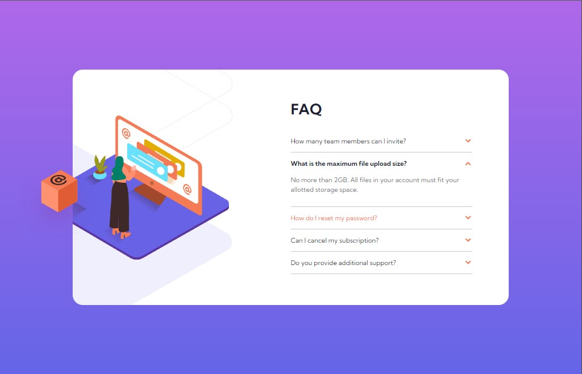

# frontend-mentor-challenge-8
frontend-mentor-challenge the link https://abubakr404.github.io/frontend-mentor-challenge-8/

# Frontend Mentor - FAQ accordion card solution

This is a solution to the [FAQ accordion card challenge on Frontend Mentor](https://www.frontendmentor.io/challenges/faq-accordion-card-XlyjD0Oam). Frontend Mentor challenges help you improve your coding skills by building realistic projects. 

- [Overview](#overview)
  - [The challenge](#order-summary-component-main)
  - [Screenshot](#screenshot)
- [Author](#author)

## Overview

### The challenge

Users should be able to:

- See hover states for interactive elements

### Screenshot

## Author

- Frontend Mentor - [@abubakr404](https://www.frontendmentor.io/profile/abubakr404)